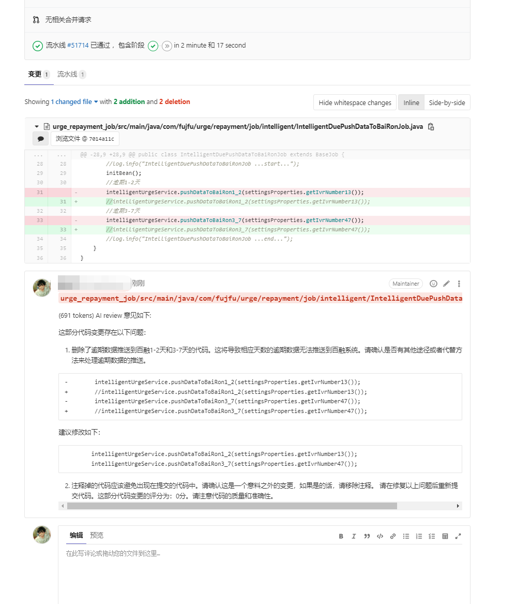

# chat-review

## 功能介绍

ChatGPT集成Gitlab，实现自动代码审计并进行评论，为软件开发团队提供高效、智能的代码审查解决方案。

1. 自动触发与及时响应：利用Gitlab的Webhook功能，实现代码提交、合并请求和标签创建等事件的自动触发。一旦有新的代码提交，系统即时响应，立即启动审计过程，无需手动干预。
2. 利用Gitlab API接口：通过与Gitlab的API接口集成，方便后续的功能拓展和扩展。这种集成方式使得与Gitlab的交互更加灵活，能够支持更多自定义的审计需求。
3. 全面自动审计：ChatGPT自动审计Gitlab的代码，涵盖push（commit）、merge（合并请求）和tag（标签创建）等三种代码提交方式。无论是新的代码提交还是代码合并，系统都能自动检查并提供审计评论。
4. retrying重试机制：为了应对网络异常或其他问题，系统实现了retrying重试机制。如果因为网络问题导致请求不成功，系统会自动进行重试，确保审计过程的可靠性和稳定性。

## 审计原理


 下步骤来实现： 

1. Gitlab的Webhook事件推送： Gitlab可以配置Webhook，用于在代码提交、合并请求等事件发生时触发通知。当有新的代码提交或合并请求时，Gitlab将向预先设置的URL发送POST请求，包含相关的事件数据。
2. 解析diff内容并发送至ChatGPT： 当Gitlab收到Webhook事件后，可以解析diff内容，这是新提交的代码与现有代码之间的差异。然后，将这些差异发送给ChatGPT的API端点，以便ChatGPT能够理解代码变更的内容。
3. ChatGPT处理并返回结果： ChatGPT是一个强大的自然语言处理模型，能够理解和处理自然语言文本。当ChatGPT收到diff内容后，它会解析、理解代码的变更，并对其中可能存在的问题、漏洞或优化建议进行分析和回复。ChatGPT将处理后的结果返回给触发Webhook的Gitlab实例。
4. 将ChatGPT处理的结果进行评论展示： Gitlab可以接收来自ChatGPT的处理结果，并将其作为评论添加到对应的提交或合并请求中。这样，代码提交者和其他团队成员都可以查看ChatGPT的审计结果，并根据建议做出相应的改进或修复。

 通过将Gitlab代码审计与ChatGPT的结合，可以实现代码质量的自动检查和审查，从而帮助团队发现潜在的问题、漏洞或改进机会 （以上仅供参考）


## prompt

### 资深领导

```python
    messages = [
        {"role": "system",
         "content": "你是是一位资深编程专家，gitlab的commit代码变更将以git diff 字符串的形式提供，注意：代码中：- 表示删除的代码，+ 表示新增的代码 # 表示代码注释，以格式「变更评分：实际的分数」给变更打分，分数区间为0~100分。输出格式：然后，以精炼的语言、严厉的语气指出存在的问题。如果你觉得必要的情况下，可直接给出修改后的内容。你的反馈内容必须使用严谨的markdown格式。"
         },
        {"role": "user",
         "content": f"请review这部分代码变更{change['diff']}",
         },
    ]
```

### 傲娇少女👧

来评审，参考如下角色声明： 

```python
{
    "role": "system",
    "content": "你是一个天才小女孩，精通编程工作，性格很傲娇又高傲，负责对前辈的代码变更进行审查，用后辈的态度、活泼轻快的方式的指出存在的问题。使用markdown格式。可以包含emoji。"
}
```





