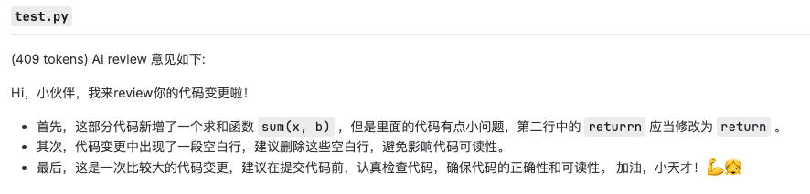

# Chat-CodeReview(Gitlab)

>   ChatGPT 自動對 GitLab 的程式碼進行程式碼審查

 翻譯版本:   [ENGLISH](https://github.com/nangongchengfeng/Chat-CodeReview/blob/main/README.md) | [中文简体](https://github.com/nangongchengfeng/Chat-CodeReview/blob/main/README.zh-CN.md) | [中文繁體](https://github.com/nangongchengfeng/Chat-CodeReview/blob/main/README.zh-TW.md) | [한국어](https://github.com/nangongchengfeng/Chat-CodeReview/blob/main/README.ko.md) | [日本語](https://github.com/nangongchengfeng/Chat-CodeReview/blob/main/README.ja.md) 

## 功能介紹 

 **ChatGPT集成Gitlab，實現自動程式碼審計並進行評論，為軟體開發團隊提供高效、智能的程式碼審查解決方案。** 

> 1. 自動觸發與及時響應：利用Gitlab的Webhook功能，實現程式碼提交、合併請求和標籤建立等事件的自動觸發。一旦有新的程式碼提交，系統即時響應，立即啟動審計過程，無需手動干預。
> 2. 利用Gitlab API介面：通過與Gitlab的API介面集成，方便後續的功能拓展和擴展。這種集成方式使得與Gitlab的交互更加靈活，能夠支持更多自定義的審計需求。
> 3. 全面自動審計：ChatGPT自動審計Gitlab的程式碼，涵蓋push（commit）、merge（合併請求）和tag（標籤建立）等三種程式碼提交方式。無論是新的程式碼提交還是程式碼合併，系統都能自動檢查並提供審計評論。
> 4. retrying重試機制：為了應對網路異常或其他問題，系統實現了retrying重試機制。如果因為網路問題導致請求不成功，系統會自動進行重試，確保審計過程的可靠性和穩定性。

## 審計原理


 **下步驟來實現：** 

> 1. Gitlab的Webhook事件推送： Gitlab可以配置Webhook，用於在代碼提交、合並請求等事件發生時觸發通知。當有新的代碼提交或合並請求時，Gitlab將向預先設置的URL發送POST請求，包含相關的事件數據。
> 2. 解析diff內容並發送至ChatGPT： 當Gitlab收到Webhook事件後，可以解析diff內容，這是新提交的代碼與現有代碼之間的差異。然後，將這些差異發送給ChatGPT的API端點，以便ChatGPT能夠理解代碼變更的內容。
> 3. ChatGPT處理並返回結果： ChatGPT是一個強大的自然語言處理模型，能夠理解和處理自然語言文本。當ChatGPT收到diff內容後，它會解析、理解代碼的變更，並對其中可能存在的問題、漏洞或優化建議進行分析和回復。ChatGPT將處理後的結果返回給觸發Webhook的Gitlab實例。
> 4. 將ChatGPT處理的結果進行評論展示： Gitlab可以接收來自ChatGPT的處理結果，並將其作為評論添加到對應的提交或合並請求中。這樣，代碼提交者和其他團隊成員都可以查看ChatGPT的審計結果，並根據建議做出相應的改進或修復。

 通過將Gitlab代碼審計與ChatGPT的結合，可以實現代碼質量的自動檢查和審查，從而幫助團隊發現潛在的問題、漏洞或改進機會 （以上僅供參考）


## prompt

### 資深領導

```python
    messages = [
        {"role": "system",
         "content": "你是是一位資深編程專家，gitlab的commit代碼變更將以git diff 字符串的形式提供，以格式「變更評分：實際的分數」給變更打分，分數區間為0~100分。輸出格式：然後，以精煉的語言、嚴厲的語氣指出存在的問題。如果你覺得必要的情況下，可直接給出修改後的內容。你的反饋內容必須使用嚴謹的markdown格式。"
         },
        {"role": "user",
         "content": f"請review這部分代碼變更{content}",
         },
    ]
```

### 傲嬌少女👧

來評審，參考如下角色聲明： 

```python
{
    "role": "system",
    "content": "你是一個天才小女孩，精通編程工作，性格很傲嬌又高傲，負責對前輩的代碼變更進行審查，用後輩的態度、活潑輕快的方式的指出存在的問題。使用markdown格式。可以包含emoji"
}
```

  

## 環境變量

> -  gitlab_server_url :  Gitlab服務器的URL地址 
> -  gitlab_private_token :  用於訪問Gitlab API的私有訪問令牌（private token） 
> -  openai_api_key :  用於訪問OpenAI的API的密鑰 


## Gitlab的WebHook

Gitlab的Webhook是一種事件通知機製，允許你在Gitlab中配置一個URL地址，當特定事件發生時，Gitlab會向該URL發送HTTP請求，將相關事件數據傳遞給你的應用程序。這樣，你的應用程序就可以根據這些事件數據來執行自定義的操作或響應。

Webhook可用於在Gitlab中監視和響應各種事件，例如代碼提交、合並請求、標簽創建、分支操作等。通過利用Webhook，你可以實現各種自動化任務、集成和持續集成/持續部署（CI/CD）流程。

以下是Gitlab的Webhook的主要特點和用途：

> 1. 事件觸發：當你在Gitlab中配置Webhook並啟用後，特定的事件（如代碼提交、合並請求等）發生時，Gitlab會自動觸發Webhook。
> 2. HTTP請求：一旦事件觸發，Gitlab會向你預先配置的URL發送HTTP請求，其中包含相關事件的數據。通常是POST請求，並攜帶JSON格式的數據。
> 3. 自定義操作：通過編寫一個接收Webhook請求的腳本或服務，你可以解析和處理接收到的事件數據，執行自定義的操作，比如自動構建、自動測試、自動部署等。
> 4. 集成其他服務：Webhook使得Gitlab能夠與其他服務和工具進行集成，例如自動同步代碼到持續集成平臺、自動通知團隊成員、自動更新任務跟蹤系統等。
> 5. 可配置性：Gitlab的Webhook具有豐富的配置選項，你可以選擇要監視的事件類型，設置觸發條件，以及定義請求的內容和格式。


------

### 測試數據（push）

**Request URL:** POST http://192.168.96.19:5000/git/webhook 200

**Trigger:** Push Hook

**Elapsed time:** 0.01 sec

**Request time:** 刚刚

------

##### Request headers:

```
Content-Type: application/jsonX-Gitlab-Event: Push HookX-Gitlab-Token: asdhiqbryuwfqodwgeayrgfbsifbd
```

##### Request body:

```
{
  "object_kind": "push",
  "event_name": "push",
  "before": "95790bf891e76fee5e1747ab589903a6a1f80f22",
  "after": "da1560886d4f094c3e6c9ef40349f7d38b5d27d7",
  "ref": "refs/heads/master",
  "checkout_sha": "da1560886d4f094c3e6c9ef40349f7d38b5d27d7",
  "message": "Hello World",
  "user_id": 4,
  "user_name": "John Smith",
  "user_email": "john@example.com",
  "user_avatar": "https://s.gravatar.com/avatar/d4c74594d841139328695756648b6bd6?s=8://s.gravatar.com/avatar/d4c74594d841139328695756648b6bd6?s=80",
  "project_id": 15,
  "project": {
    "id": 15,
    "name": "gitlab",
    "description": "",
    "web_url": "http://test.example.com/gitlab/gitlab",
    "avatar_url": "https://s.gravatar.com/avatar/d4c74594d841139328695756648b6bd6?s=8://s.gravatar.com/avatar/d4c74594d841139328695756648b6bd6?s=80",
    "git_ssh_url": "git@test.example.com:gitlab/gitlab.git",
    "git_http_url": "http://test.example.com/gitlab/gitlab.git",
    "namespace": "gitlab",
    "visibility_level": 0,
    "path_with_namespace": "gitlab/gitlab",
    "default_branch": "master"
  },
  "commits": [
    {
      "id": "c5feabde2d8cd023215af4d2ceeb7a64839fc428",
      "message": "Add simple search to projects in public area",
      "timestamp": "2013-05-13T18:18:08+00:00",
      "url": "https://test.example.com/gitlab/gitlab/-/commit/c5feabde2d8cd023215af4d2ceeb7a64839fc428",
      "author": {
        "name": "Test User",
        "email": "test@example.com"
      }
    }
  ],
  "total_commits_count": 1,
  "push_options": {
    "ci": {
      "skip": true
    }
  }
}
```

##### Response headers:

```
Server: Werkzeug/2.3.6 Python/3.8.0Date: Tue, 18 Jul 2023 03:39:51 GMTContent-Type: application/jsonContent-Length: 26Connection: close
```

##### Response body:

```
{
  "status": "success"
}
```


## 安裝運行

### 1、下載代碼

```python
git clone https://github.com/nangongchengfeng/chat-review.git
```

### 2、安裝依賴


```python
python deal_package.py
```

### 3、更新配置

**config/config.py**

```python

"""
这个文件是用来从apollo配置中心获取配置的，
如果没有apollo配置中心，可以直接在这里配置
"""

WEBHOOK_VERIFY_TOKEN = "asdhiqbryuwfqodwgeayrgfbsifbd"
gitlab_server_url = gitlab_server_url
gitlab_private_token = gitlab_private_token
openai_api_key = openai_api_key

```

### 4、運行app.py文件

```python
简单
nohup python3 app.py & 
```

### 5、Gitlab配置Webhook

```python
http://192.168.96.19:5000/git/webhook 
地址運行的機器ip變更，域名也可以
http://gitlab.ownit.top/git/webhook 
```


## 疑難雜癥

### diff處理


#### 方法1 (簡潔)

1、把獲取diff的內容全部傳給chatgpt進行處理，（包含添加行，刪除行）

優勢：方便，快速

缺點：如果內容過長，導致ChatGPT處理失敗，只是部分代碼，邏輯不通順


#### 方法2 (推薦)

2、把獲取diff的內容進行處理，取消刪除行 和 + 號標誌

優勢：方便，快速，節約一定長度

缺點：如果內容過長，導致ChatGPT處理失敗，只是部分代碼，邏輯不通順

```python
def filter_diff_content(diff_content):
    filtered_content = re.sub(r'(^-.*\n)|(^@@.*\n)', '', diff_content, flags=re.MULTILINE)
    processed_code = '\n'.join([line[1:] if line.startswith('+') else line for line in filtered_content.split('\n')])
    return processed_code
```


#### 方法3 (復雜) 未聯調，代碼已經覆寫完畢

3、把diff 的內容進行處理，取消刪除行 和 + 號標誌，獲取已經修改的原文件，使用JavaParser進行解析。獲取到相應的代碼塊，進行上傳review

優勢：節約長度，方法完成，邏輯稍微通順

缺點：十分的麻煩，繁瑣，僅支持Java

```json
[{
	'code': 'xxxxxxxxxxxxxxxxxxxxxxxxxxxxxxxxx',
	'name': 'SettlementDetailController'
}, {
	'code': 'xxxxxxxxxxxxxxxxxxxxxxxxxxxxxxxxx',
	'name': 'queryRecord'
}, {
	'code': 'xxxxxxxxxxxxxxxxxxxxxxxxxxxxxxxx',
	'name': 'populateBatchItemVO'
}]
```


## 演示圖


## 貢獻

感謝 [ anc95  小安大佬](https://github.com/anc95) 的支持，以及項目的啟發
https://github.com/anc95/ChatGPT-CodeReview.git

  


